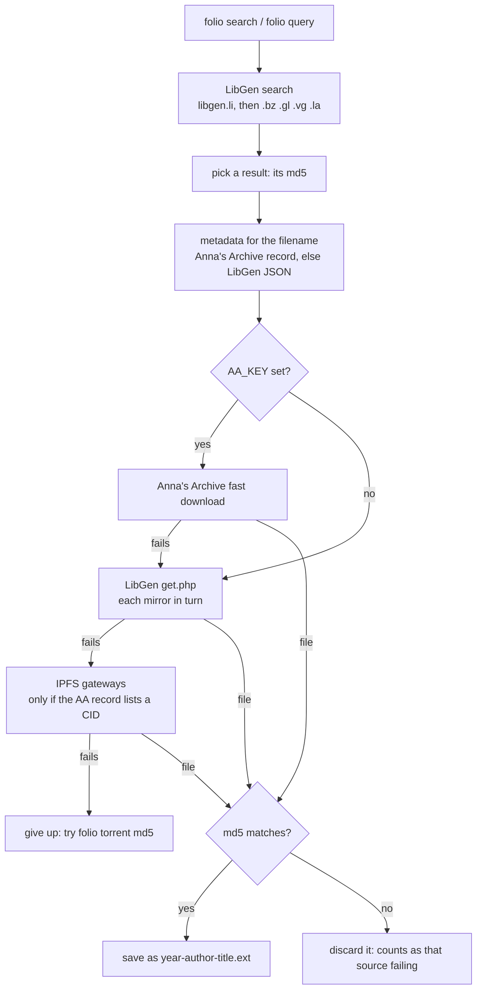

# folio

[](https://github.com/jonaprieto/folio/actions/workflows/ci.yml)
[](https://www.python.org)
[](folio)
[](LICENSE)
[](#install)

Search for a book or paper from the terminal, pick one, and get a verified, well-named file. `folio` is a client for [Anna's Archive](https://annas-archive.gl) and [Library Genesis](https://libgen.li); it hosts nothing itself.

> [!WARNING]
> Anna's Archive and Library Genesis are shadow libraries. Much of what they hold is under copyright, and downloading it can be illegal where you live. Both sites have been sued, and their domains get seized and blocked. Use `folio` only for material you have the right to access, such as public domain works, openly licensed books and papers, or copies you already own. You are responsible for what you download. See [Legal](#legal).

```
$ folio introduction to algorithms

   2  Introduction to Algorithms 4
      Thomas H. Cormen, Charles E. Leiserson et al.
       PDF   12 MB  2022

   3  Introduction to Algorithms 3rd edition
      Leiserson, Charles E., Rivest, Ronald L. et al.
       PDF   5 MB  2009

  10 of 100+ shown   2 download  1,3-5 several  i2 info  t2 torrent  m more  any text new search  q quit
folio> 2
  [2] Introduction to Algorithms 4  pdf, 12 MB
  trying libgen.li ...
  saved ~/Downloads/2022-cormen-introduction-to-algorithms-4.pdf
```

`folio` is a single Python file with no dependencies beyond the standard library.

## Install

With Homebrew:

```sh
brew tap jonaprieto/folio https://github.com/jonaprieto/folio
brew trust --formula jonaprieto/folio/folio   # third-party taps need it
brew install folio
```

Or grab the single file, which only needs Python 3.9 or newer:

```sh
curl -fsSL https://raw.githubusercontent.com/jonaprieto/folio/main/folio -o ~/.local/bin/folio
chmod +x ~/.local/bin/folio
folio selftest
```

Or clone the repo and symlink `folio` into a directory on your `PATH`.

## Usage

```
folio [query...]          interactive: search, pick by number, download
folio search <query...>   print md5, format, size, year, kind and title per result
folio info <md5>          Anna's Archive record summary
folio get <md5>... [-o DIR]  download files, print each saved path
folio torrent <md5>       magnet link and the file's path inside the torrent
folio selftest            offline checks
```

At the `folio>` prompt:

| input | does |
|---|---|
| `2`, `1,3-5` | download those results |
| `i2` | details for result 2 |
| `t2` | torrent for result 2 |
| `m` or Enter | show more results, fetching the next page when needed |
| any other text | new search (`/1984` forces a search for something numeric) |
| `q` | quit |

## Scripting and AI agents

`search` and `get` never prompt, so scripts and coding agents can drive them.

```sh
folio search --ext pdf --year 2015-2020 -n 5 deep learning goodfellow
folio search --articles --json attention is all you need
folio search --json 10.1007/978-3-540-75183-0_13
folio search --json https://doi.org/10.1007/978-3-540-75183-0_13
folio get 18e1b007a1dab45b30cc861ba2dfda25 -o papers
```

`search` takes `-n N` (default 20), `--ext pdf,epub`, `--year 2017` or a range like `2015-2020`, `--lang English`, and `--articles` or `--books`; `--json` prints an array of `md5`, `title`, `author`, `year`, `lang`, `size`, `ext` and `article`. It exits 1 when nothing matches. `get` takes several md5s, prints one saved path per line on stdout, keeps progress on stderr, and exits 1 if any download failed.

DOIs work in both `search` and the interactive prompt: use the bare identifier,
`doi:10.…`, or a `doi.org/10.…` link with or without `http://` or `https://`.
Legacy `dx.doi.org` links work too. Results include only downloadable files;
LibGen may know a DOI's metadata without having its file.

[`skills/folio/SKILL.md`](skills/folio/SKILL.md) teaches Claude Code and other agents to use it. Install it with

```sh
mkdir -p ~/.claude/skills && ln -s "$PWD/skills/folio" ~/.claude/skills/folio
```

## Where files come from

Search uses [libgen.li](https://libgen.li), because [Anna's Archive search](https://annas-archive.gl/search) sits behind a browser challenge.



For each download `folio` tries, in order:

1. the [Anna's Archive member API](https://annas-archive.gl/faq#api), when `AA_KEY` is set (get a key by [becoming a member](https://annas-archive.gl/donate));
2. LibGen's direct download link, moving to the next mirror when one fails;
3. public [IPFS](https://ipfs.tech) gateways, when Anna's Archive exposes the file's IPFS CID.

Anna's Archive publishes its [whole collection as torrents](https://annas-archive.gl/torrents); `folio torrent` points at the one holding a file. Its domain moves from time to time, and the [Wikipedia article](https://en.wikipedia.org/wiki/Anna%27s_Archive) lists the current ones.

A file is kept only if its md5 matches the one you picked. Gateways often answer with an HTML page and a success status, so the md5 is what decides.

## Filenames

Downloads are named `[year]-[author]-[title]` in lowercase with ASCII-only words and the title cut at 40 characters on a word boundary, the Reference preset from [papershelf](https://github.com/jonaprieto/papershelf), for example `2022-cormen-introduction-to-algorithms-4.pdf`. An existing file is never overwritten; the new one gets an md5 suffix instead.

## Configuration

| variable | default | meaning |
|---|---|---|
| `FOLIO_DIR` | `~/Downloads` | download folder |
| `FOLIO_NAME` | `[year]-[author]-[title]` | filename pattern; `original` keeps the server's name |
| `FOLIO_OPEN` | `1` | set to `0` to not open files after an interactive download |
| `AA_KEY` | | Anna's Archive member secret key, for fast downloads |
| `AA_DOMAIN` | `annas-archive.gl` | Anna's Archive domain, which moves from time to time |
| `LG_DOMAIN` | `libgen.li` | LibGen mirror to try first; `libgen.li`, `.bz`, `.gl`, `.vg` and `.la` follow when it fails |

## Limits

- Search only covers what LibGen indexes. Files that only Anna's Archive holds need their md5, for `folio get`.
- LibGen matches titles, authors, ISBNs and DOIs, and often files arXiv papers as books, so `--articles` can miss them.
- Sci-Hub is not queried directly; DOI searches use LibGen's index.
- Anna's Archive record JSON is members-only for most files, so without `AA_KEY` the `info` and `torrent` commands show less.
- The md5 check catches broken and substituted downloads. It cannot catch a hostile mirror, because the md5 comes from the same server as the file.
- Sites change their HTML. If search suddenly returns nothing, run `folio selftest` and open an issue.

## Legal

`folio` is a search and download client. It does not host, mirror or index any files, and it goes through the same public pages and the documented member API that a browser would use. It does not bypass the sites' browser challenges.

Many files on these sites are under copyright, and downloading them may be illegal where you live, with penalties that range from fines to criminal charges. Check the law in your country before using `folio`. Use it for material you have the right to access. This software comes with no warranty (see the [license](LICENSE)), and its author takes no responsibility for how it is used.

## Acknowledgements

`folio` is only a thin client. The work is done by:

- [Anna's Archive](https://annas-archive.gl), which preserves books and papers from many collections and publishes its [code](https://software.annas-archive.gl/) and [data](https://annas-archive.gl/datasets) openly. If `folio` saves you time, consider [supporting it](https://annas-archive.gl/donate). A membership also gives you fast downloads through `AA_KEY`.
- [Library Genesis](https://libgen.li) and its mirrors, which provide the search and most direct downloads.
- [Sci-Hub](https://en.wikipedia.org/wiki/Sci-Hub), whose papers Anna's Archive mirrors.
- The public [IPFS](https://ipfs.tech) gateway operators.
- [scidownl](https://pypi.org/project/scidownl/), [calibre_annas_archive](https://github.com/ScottBot10/calibre_annas_archive) and [anna-dl](https://github.com/Nquxii/anna-dl), which showed which parts of these sites a client can rely on.

## License

[MIT](LICENSE)
